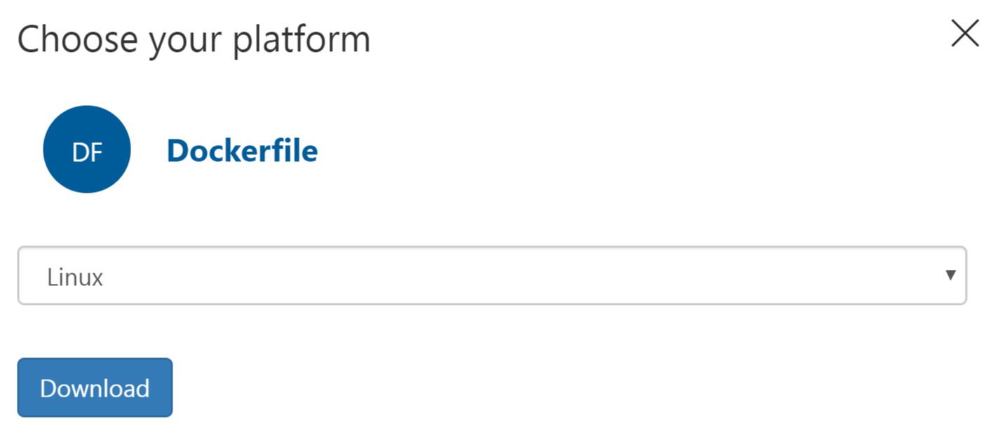
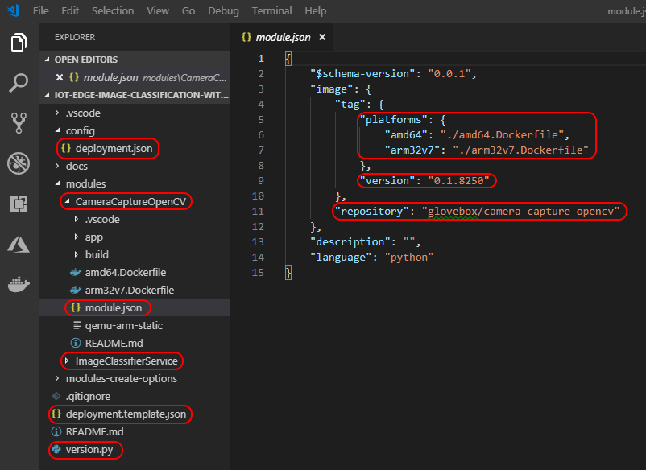

|Author|Dave Glover, Microsoft Australia|
|----|---|
|Solution| Azure Machine Learning, Image Classification & Intelligent Edge Devices|
|Platform| [Azure IoT Edge](https://docs.microsoft.com/en-us/azure/iot-edge/)|
|Documentation | [Azure IoT Edge](https://docs.microsoft.com/en-us/azure/iot-edge/), [Azure Custom Vision](https://azure.microsoft.com/en-au/services/cognitive-services/custom-vision-service/), [Azure Speech services](https://azure.microsoft.com/en-au/services/cognitive-services/speech-services/),  [Azure Functions on Edge](https://docs.microsoft.com/en-us/azure/iot-edge/tutorial-deploy-function), [Stream Analytics](https://docs.microsoft.com/en-us/azure/iot-edge/tutorial-deploy-stream-analytics), [Machine Learning services](https://docs.microsoft.com/en-us/azure/iot-edge/tutorial-deploy-machine-learning) |
|Video Training|[Enable edge intelligence with Azure IoT Edge](https://channel9.msdn.com/events/Connect/2017/T253)|
|Date|As at Oct 2018|

<!-- TOC -->

- [1. Image Classification with Azure IoT Edge](#1-image-classification-with-azure-iot-edge)
    - [1.1. Solution Overview](#11-solution-overview)
- [2. What is Azure IoT Edge?](#2-what-is-azure-iot-edge)
    - [2.1. Azure IoT Edge in Action](#21-azure-iot-edge-in-action)
    - [2.2. Solution Architectural Considerations](#22-solution-architectural-considerations)
- [3. Azure Services](#3-azure-services)
    - [3.1. Creating the Fruit Classification Model](#31-creating-the-fruit-classification-model)
    - [3.2. Exporting an Azure Custom Vision Model](#32-exporting-an-azure-custom-vision-model)
    - [3.3. Azure Speech Services](#33-azure-speech-services)
- [4. How to install and run the solution](#4-how-to-install-and-run-the-solution)
    - [Understanding the Project Structure](#understanding-the-project-structure)

<!-- /TOC -->

# 1. Image Classification with Azure IoT Edge

The scenarios for this Machine Learning Image Classification solution include self-service shopping for vision impaired people or someone new to a country who is unfamiliar with local product names.

## 1.1. Solution Overview

At a high level, the solution takes a photo of a piece of fruit, gets the name of the fruit from a trained image classifier, converts the name of the fruit to speech and plays back the name of the fruit on the attached speaker.

The solution runs of [Azure IoT Edge](#what-is-azure-iot-edge) and consists of a number of services.

1. The **Camera Capture Module** is responsible for capturing an image from the camera, calling the Image Classification REST API, then calling the Text to Speech REST API and finally playing bask in the classified image label on the speaker.  

2. The **Image Classification Module** is responsible for classifying the image that was passed to it from the camera capture module.

3. The **Text to Speech Module** passes the text label return from the image classifier module and converts to speech using the Azure Speech Service. As an optimization, this module also caches speech data.

4. USB Camera for Image Capture is used for image capture.

5. A Speaker for text to Speech playback.

6. I used the free tier of **Azure IoT Hub** for managing, deploying and reporting the IoT Edge device.

7. The **Azure Speech to Text service** free tier was used for text to speech services.

8. And **Azure Custom Vision** was used to build the Image Classification model that forms the basis of the Image Classification module.


# 2. What is Azure IoT Edge?

The solution is built on [Azure IoT Edge](https://docs.microsoft.com/en-us/azure/iot-edge/) which is part of the Azure IoT Hub service and is used to define, secure and deploy a solution to an edge device. It also provides cloud-based central monitoring and reporting of the edge device.

The main components for an IoT Edge solution are:-

1. The [IoT Edge Runtime](https://docs.microsoft.com/en-us/azure/iot-edge/iot-edge-runtime) which is installed on the local edge device and consists of two main components. The **IoT Edge "hub"**, responsible for communications, and the **IoT Edge "agent"**, responsible for running and monitoring modules on the edge device.

2. [Modules](https://docs.microsoft.com/en-us/azure/iot-edge/iot-edge-modules). Modules are the unit of deployment. Modules are docker images pulled from a registry such as the [Azure Container Registry](https://azure.microsoft.com/en-au/services/container-registry/), or [Docker Hub](https://hub.docker.com/). Modules can be custom developed, built as [Azure Functions](https://docs.microsoft.com/en-us/azure/iot-edge/tutorial-deploy-function), or exported services from [Azure Custom Vision](https://docs.microsoft.com/en-us/azure/iot-edge/tutorial-deploy-stream-analytics), [Azure Machine Learning](https://docs.microsoft.com/en-us/azure/iot-edge/tutorial-deploy-machine-learning), or [Azure Stream Analytics](https://docs.microsoft.com/en-us/azure/iot-edge/tutorial-deploy-stream-analytics).

3. Routes. Routes define message paths between modules and with IoT Hub.

4. Properties. You can set the "desired" properties for a module from Azure IoT Hub. For example, you might want to set a threshold property for a temperature alert.

5. Create Options. Create Options tell Docker runtime what options to start the Module/Docker Container with. For example, you may wish to open ports for REST APIs or debugging ports, define paths to devices such as a USB Camera, set environment variables, or enable privilege mode for certain hardware operations.

6. [Deployment Manifest](https://docs.microsoft.com/en-us/azure/iot-edge/module-composition). The Deployment Manifest tells the IoT Edge runtime what modules to deploy and what container registry to pull them from and includes the routes and create options information.

## 2.1. Azure IoT Edge in Action


## 2.2. Solution Architectural Considerations

So with that overview of Azure IoT Edge here were my initial considerations and constraints for the solution.

1. The solution should scale from a Raspberry Pi (running Raspbian Linux) on ARM32v7, to my desktop development environment, to an industrial capable IoT Edge device such as those found in the [Certified IoT Edge Catalog](https://catalog.azureiotsolutions.com/).

2. The solution required camera input, I used a USB Webcam for image capture as it was supported across all target devices.

3. The camera capture module required Docker USB device pass-through (not supported by Docker on Windows) so that plus targeting Raspberry Pi meant that I need to target Azure IoT Edge on Linux.

4. I wanted my developer experience to mirror the devices I was targeting plus I needed Docker support for the USB webcam, so I developed the solution from Ubuntu 18.04. See my [Ubuntu for Azure Developers](https://gloveboxes.github.io/Ubuntu-for-Azure-Developers/) guide.

    - As a workaround, if your development device is locked to Windows then use Ubuntu in Virtual Box which allows USB device pass-through which you can then pass-through to Docker in the Virtual Machine. A bit convoluted but it does work.


# 3. Azure Services

## 3.1. Creating the Fruit Classification Model

The [Azure Custom Vision](https://customvision.ai/) service is a simple way to create an image classification machine learning model without having to be a data science or machine learning expert. You simply upload multiple collections of labeled images. For example, you upload a collection of bananas images and you label them as 'bananas'.

To create your own classification model read [How to build a classifier with Custom Vision](https://docs.microsoft.com/en-us/azure/cognitive-services/custom-vision-service/getting-started-build-a-classifier) for more information. It is important to have a good variety of labeled images so be sure to read [How to improve your classifier](https://docs.microsoft.com/en-us/azure/cognitive-services/custom-vision-service/getting-started-improving-your-classifier) for more information.

## 3.2. Exporting an Azure Custom Vision Model

This "Image Classification" module in this sample includes a simple fruit classification model that was exported from Azure Custom Vision. Be sure to read how to [Export your model for use with mobile devices](https://docs.microsoft.com/en-us/azure/cognitive-services/custom-vision-service/export-your-model). It is important to select one of the "**compact**" domains from the project settings page otherwise you will not be able to export the model.

Follow these steps to export your Custom Vision project model.

1. From the **Performance** tab of your Custom Vision project click **Export**.

    

2. Select Dockerfile from the list of available options

    

3. Then select the Linux version of the Dockerfile.

   

4. Download the docker file and unzip and you have a ready-made Docker solution containing a Python Flask REST API. This was how I created the Azure IoT Edge Image Classification module. Too easy:)

## 3.3. Azure Speech Services

[Azure Speech services](https://azure.microsoft.com/en-au/services/cognitive-services/speech-services/) supports both speech to text and text to speech. For this solution, I'm using the text to speech F0 free tier which is limited to 5 million characters per month. You'll need to create the service for your unique key to use for this app.

# 4. How to install and run the solution

1. Clone this GitHub

   ```bash
    git....
   ```

2. Install the Azure IoT Edge runtime on your Linux desktop or device (eg Raspberry Pi).

    Follow the instructions to [Deploy your first IoT Edge module to a Linux x64 device](https://docs.microsoft.com/en-us/azure/iot-edge/quickstart-linux).

3. Install the following software development tools.

    1. [Visual Studio Code](https://code.visualstudio.com/)
    2. The following Visual Studio Code Extensions
        - [Azure IoT Edge](https://marketplace.visualstudio.com/items?itemName=vsciot-vscode.azure-iot-edge)
        - [JSON Tools](https://marketplace.visualstudio.com/items?itemName=eriklynd.json-tools) useful for modifying the "Create Options" for a module.

4. Open the IoT Edge solution you cloned to your local machine and expand the modules section.

## Understanding the Project Structure

The following describe the highlighted sections of the project.

1. There are two modules: CameraCaptureOpenCV and ImageClassifierService.

2. The module.json file defines the Docker build process, the module version, and your docker repository.

3. The deployment.template.json file is used by the build process to create the [Deployment Manifest](https://docs.microsoft.com/en-us/azure/iot-edge/module-composition).

